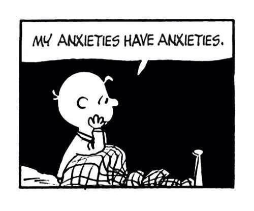

Millioner av mennesker har jobber som er avhengig av å kommunisere og overbevise andre mennsker. 

Jeg er en av disse millionene. 

Men hvor mange av oss forstår hvordan hjernen faktisk fungerer? 

Hvordan bestemmer folk hva de liker og ikke liker? Hvorfor sier de en ting, men snur seg så rundt å gjør noe helt annet? Og hvorfor i all verden engasjerer de ikke med mine annonser?!

Ta noen sekunder for å tenke på dette. 

Hvis du er lik meg så skaper dette spørsmålet en liten eksistensielt krise... Jeg får betalt for å overbevise hjernen til andre mennesker, men jeg vet skremmende lite om hvordan min egen hjerne faktisk fungerer. 

Hvordan kan jeg da med handen på hjertet si at jeg er en markedsfører? 

 

Heldigvis er ikke alt helt svart. 

Vi har lært mer om hjernen de siste 20 årene enn vi har lært de siste 200 000 [^1]. Vi har nå et helt eget felt innen psykologi og økonomi som heter adferdsøkonomi[^2] (jeg vet, sexy navn) som studerer hvorfor folk kjøper og hva de faktisk kommer til å gjøre. 

Denne blogger kommer for det meste til å handle om dette. **Hvorfor og hvordan hjernen kjøper**.

Mitt mål er å:

* Forklare hvordan hjernen tar beslutninger.
* Introdusere viktige konsepter innen adferdsøkonomi.
* Vise deg hvordan dette kan og blir brukt innen markedsføring. 

Jeg kommer *ikke* til å gå dypt ned i spesifikke markedstaktikker. Hvis dette er din ting så finnes det utallige blogger som forklarer disse bedre enn det jeg er i stand til. 

Men hvis du er som meg og vil ha en dypere forståelse for *hvorfor* noen ting fungerer bedre enn andre, så håper jeg det jeg skriver faller i smak.

## Så hvem er jeg? Og hvorfor er jeg kvalifisert til å snakke om dette? 

Mitt navn er Terje Sakariassen. 

[^1]: [The Golden Age of Neuroscience Has Arrived](https://www.wsj.com/articles/michio-kaku-the-golden-age-of-neuroscience-has-arrived-1408577023)
[^2]: [Behavioral economics](https://en.wikipedia.org/wiki/Behavioral_economics)

