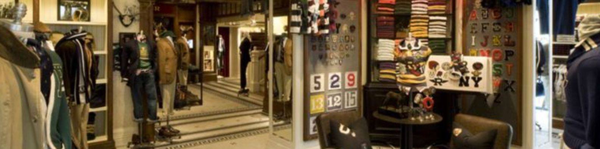
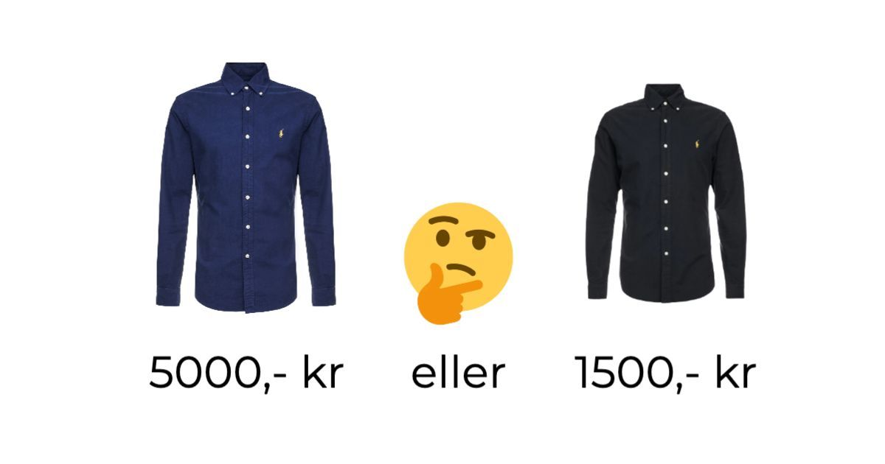

Viste du at klesmerke Ralph Lauren har egne butikker? Som inntrønder kan jeg med handen på hjerte si at dette var helt ukjent for meg.

Jeg ble derfor ganske nyskjerrig når jeg på en tur i Tokyo kom over en av deres butikker. 

Butikken fanget oppmerksomhet siden den så veldig dyrere ut enn alle de andre butikkene i samme gate. Samtidig var jeg en stolt eier av hele tre skjorter fra dem, og tanken på at jeg kunne introdusere en fjerde til samlingen var ikke helt ukjent. 

Det første jeg la merke til når jeg gikk inn i lokalene var at de hadde mistenkelig lite klær til å være en klesbutikk, og heller ingen kasse der jeg kunne betale. 

De hadde i stedet bare noen få skjorter som var presentert på en måte som gjorde det helt umulig å ikke legge merke til dem.

Jeg gikk over til den første som jeg tenkte kunne se bra ut på meg, snudde over prislappen og fikk umiddelbart "500 Internal Server Error" feilmelding fra hjernen. Prisen skjorten var 60 000 yen, ca 5 000 norske kroner. 

Etter noen sekunder gikk det opp for meg at dette var den dyreste skjorten jeg noen ganger har sett. 

Jeg stakk så av med pengene mine, sjokkert over opplevelsen... 

Det jeg ikke skjønte den gangen var at jobben til prislappen på 60 000yen ikke var å selge skjorten til 5 000 kroner. Jobben til prislappen (og jeg mistenker hele butikken) var å få alle andre Ralph Lauren skjorter til å virke som god verdi i sammenligning.

Når jeg nå ser Ralph Lauren skjorter på Zalando blir jeg ikke sjokkert over prisen. Jeg blir lettet. 

De koster jo bare 1 500, langt i fra 5 000 kroner!

Dette er ankringseffekten.

## "*It starts at only 499$*"

Hvis du er like interessert i teknologi som meg så husker du kanskje dette klippet fra Apples lansering av iPad i 2010. 

En iPhone 3GS kostet på den tiden 199 dollar, og store deler av internett var overbevist om at en stor iPhone neppe kunne koste mer enn det dobbelte. 

Men under lanseringen presenterte Steve Jobs ikke bare en iPad med en prislapp. Han brukte i stedet en del av presentasjonen til å fremheve at noen mente prisen var rundt 1 000 dollar. 

Samtidig som han snakket sto det $999 med stor skrift på presentasjonen i bakgrunnen. Slik at det ikke var noe tvil om at denne prisen ble forankret til alle i rommet. Så avsluttet han med å si: 

"*I'm thrilled to announce that the iPad pricing starts at not 999, but at just 499 dollars.*"

Ved å forankre en pris på 999 dollar ble 499 en lettelse. 

Plutselig var en pris to og en halv gang dyrere enn en iPhone ikke bare akseptabelt, men *billig*.

Dette er ankringseffekten.

`youtube: DbkEXYRif1Q`

## Førstemann til mølla

Ankringseffekten sier at hjernen legger større vekt på den første delen av informasjon den ser, og at fremtidige informasjon blir veid opp mot dette "ankret" [^fn1].

Eller sagt på en bedre måte: Det du ser først påvirker hvordan du tolker det som kommer etterpå. 

> Det du ser først påvirker hvordan du tolker det som kommer etterpå.

Alle store merkevarer vet dette, og plasserer derfor tydelige "anker" rundt om i deres markedsføring.  

Dette er grunnen til at bilforhandlere plasserer de dyreste bilmodellene fremst i butikken, selv om de ganske sikkert selger veldig få av disse. Dette er også grunnen til at reiseselskaper først presenterer dyre ferieturer, slik at de billigere (og ganske sikkert mer lønnsom) turene høres mer fornuftig ut.

SaaS (Software as a Service) bedrifter har blitt ekstremt rutinert på hvordan ankrer i sin markedsføring. Se på de forskjellige planene til [Squarespace](https://www.squarespace.com/pricing) under: 

Advanced Commerce er Squarespace sin versjon av 5 000 kroner skjorten. Denne planen er ikke der for å selge Advanced Commerce, men er der for å få Business og Basic Commerce planene til se mer overkommelig ut. 

## Ankringseffekten og markedsføring

Ankringseffekten er en av de mest vanlige og brukte triksene i markedsføring. Denne effekten er så kraftig at den fungerer selv om du er helt klar over hva som skjer. Folk elsker å overbevise seg selv om at de tar logiske valg, og denne effekten hjelper folk med å gjøre akkurat akkurat dette. 

"*Denne skjorten koster jo bare 1 000 kroner, langt i fra 5 000. Røverkjøp!*"

Noe som betyr at folk går på denne effekten over og over igjen. Tenk derfor på hvilken informasjon du presenterer først til dine pris strategier, budskap og annonser. 

Jeg lover at dette kommer til å påvirke dine konverteringer. 

## Kilder

[^fn1]: **[The anchoring effect in business intelligence supported decision-making](https://www.tandfonline.com/doi/abs/10.1080/12460125.2019.1620573?journalCode=tjds20)**
