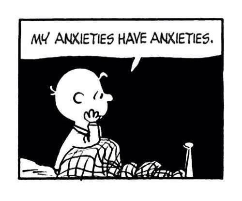

Millioner av mennesker har jobber som er avhengig av å kommunisere og overbevise andre mennesker. 

Jeg er en av disse millionene. 

Men hvor mange av oss forstår hvordan hjernen faktisk fungerer? 

Hvordan bestemmer folk hva de liker og ikke liker? Hvorfor sier de en ting, men snur seg så rundt å gjør noe helt annet? Og hvorfor i all verden engasjerer de ikke med mine annonser?!

Ta noen sekunder for å tenke på dette. 

Hvis du er lik meg så skaper dette spørsmålet en liten eksistensielt krise... Jeg får betalt for å overbevise hjernen til andre mennesker, men jeg vet skremmende lite om hvordan min egen hjerne faktisk fungerer. 

Hvordan kan jeg da med handen på hjertet si at jeg er en markedsfører? 

 

Heldigvis er ikke alt helt svart. 

Vi har lært mer om hjernen de siste 20 årene enn vi har lært de siste [200 000](https://www.wsj.com/articles/michio-kaku-the-golden-age-of-neuroscience-has-arrived-1408577023). 

Vi har nå et eget felt innen psykologi og økonomi som heter [adferdsøkonomi](https://en.wikipedia.org/wiki/Behavioral_economics) (jeg vet, bra navn) som studerer hvorfor folk kjøper og hva de faktisk kommer til å gjøre. 

Denne blogger kommer for det meste til å handle om dette. **Hvorfor og hvordan hjernen kjøper**.

Mitt mål er å:

* Forklare hvordan hjernen tar beslutninger.
* Introdusere viktige konsepter innen adferdsøkonomi.
* Vise deg hvordan dette kan og blir brukt innen markedsføring. 
* Publisere nytt innlegg hver fredag. 

Jeg kommer *ikke* til å gå dypt ned i spesifikke markedstaktikker. Hvis dette er din ting så finnes det utallige blogger som forklarer disse bedre enn det jeg er i stand til. 

Men hvis du er som meg og vil ha en dypere forståelse for *hvorfor* noen ting fungerer bedre enn andre, så håper jeg det jeg skriver faller i smak.

## Så hvem er jeg? Og hvorfor er jeg kvalifisert til å snakke om dette? 

Mitt navn er Terje Sakariassen. Født og oppvokst midt i Norge. Eller sagt på en annen måte: skikkelig inntrønder. 

Men hvis dette ikke er kvalifikasjoner nok for deg så har jeg også en bachelorgrad i digital forretningsutvikling og en mastergrad i ledelse av teknologi fra NTNU. 

Jeg har i flere år jobbet som konsulent. Der jeg har vært med og ledet flere store og små digitale prosjekter rundt om i landet. Hovedsakelig B2C. 

Grunnen til at jeg har hengt meg opp i hvordan man kommunisere og overbevise andre mennesker kommer fra en ekkel magefølelse jeg har hatt over en lengre periode. 

### If you build it, they will come

Jeg er flink til å designe (teknisk design) og lede utvikling av digitale produkter: nettsider, apper, webapper. 

Dette var dette jeg originalt tenkte at jeg skulle bygge min karriere på. 

Men etter jeg har vært med på denne prosessen ganske mange ganger startet jeg å legge merke til noe rart. 

Hvor godt et produkt gjorde det i markedet virket å ha veldig lite å gjøre med kvaliteten til produktet...

Dette skurret veldig. "If you build it, they will come" var i starten en av mine fundamentale antagelser.

Hvis du bygger et produkt som løser din målgruppes problem (+ litt markedsføring) så vil resten bare gå av seg selv. Ikke sant? 

Men det var vist ikke så enkelt. 

### Fra produktutvikling til markedsføring

Som konsulent kunne jeg bare ha ristet på hodet og ignorert problemet. 

Jeg har jo levert produktet de betalte for, ikke mitt problem at ingen gidder å bruke det. 

Men jeg er en av de kverulantene som bestandig må vite *hvorfor*. 

Denne mistanken tok meg over til markedsføring der jeg har brukt flere år på å lære alt om branding, ads, positioning, feature adoption, user retention, activation... men ingen av disse områdene svarer på hvorfor. 

Annet fagfelt, men samme problem. Jeg ble flinkere til å nå ut til folk, men klarte fremdeles ikke å svare på hvorfor folk sier de skal gjøre en ting, bare for å så gjøre det stikk motsatte.  

### Enter adferdsøkonomi

En dag mens jeg satte hjemme på pappaperm med min sønn og hørte på [Freakonomics](https://freakonomics.com/series/freakonomics-radio/) slo det meg: kanskje jeg burde sette meg inn i adferdsøkonomi?

Jeg har i flere år vært fascinert over dette fagfeltet, men for en eller annen grunn har jeg aldri trukket en parallell mellom dette og mitt yrke. 

Jeg kjøpte derfor alt jeg kunne av bøker og leste alle forskningsartikler jeg fant på Google Scholar.

Og jeg har nå endelig svar på noen av de spørsmålene som har rullet rundt i hodet de siste årene. 

Med alt dette i bakhodet valgte jeg å starte denne bloggen. For å formidle det jeg har lært, med håpet av at noen andre også finner dette nyttig. 

Så det er meg. Meld deg gjerne på mitt nyhetsbrev under hvis synes noe av dette høres kult ut👇

