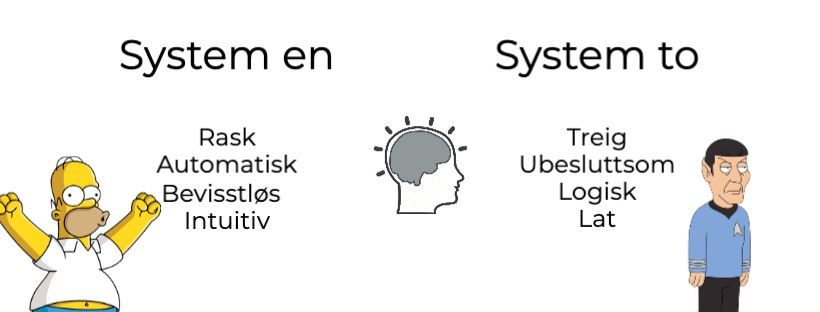
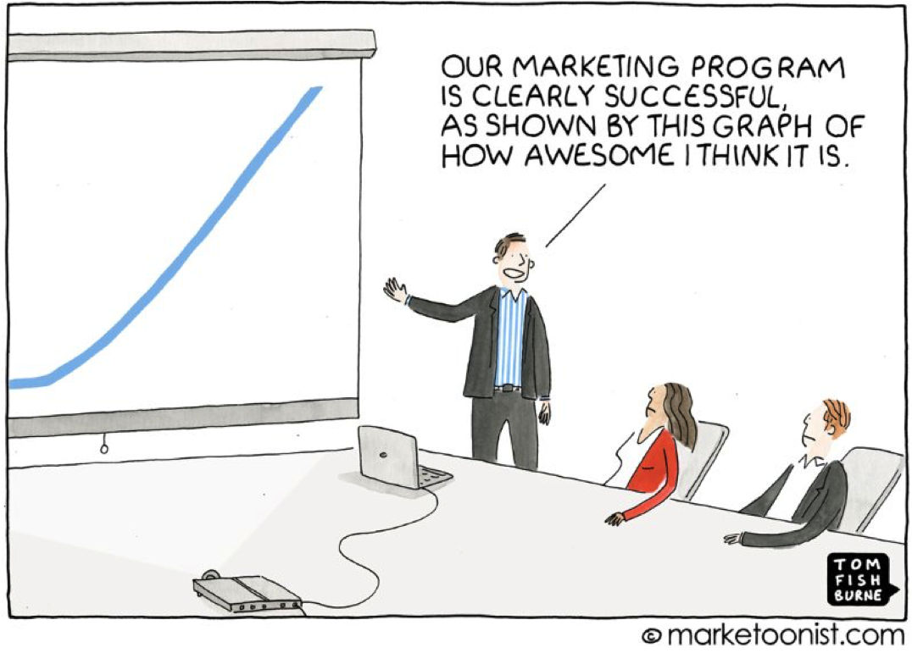

Så hvordan fungerer egentlig hjernen? 

Se for deg at du har tidenes forretningside. Du er som alle andre gründere overbevist om at din idé virkelig vil revolusjonere alt. Du trenger bare penger...

Så hva gjør du? Du spør så klart Kjell Inge Røkke om han kan investere! Han kommer jo ikke til å savne noen millioner. 

Men du kan ikke bare ringe han for å spørre om penger (eller kanskje du kan, men jeg kan ikke det).

For å komme i kontakt med han må du først gjennom en eller flere assistenter. 

Assistenter som har som jobb å stoppe slik som deg. 

Dette er også hvordan hjernen vår fungerer. 

## To systemer

I boken "Thinking fast and slow" definerer nobelprisvinner Daniel Kahneman hjernens to systemer som:

**System en (underbevisstheten)**
Dette systemet reagerer veldig raskt, og kan behandle enorme mengder informasjon på en gang. 

**System to (den beviste delen av hjernen)**
Den er mye tregere, og kan håndtere veldig lite informasjon på en gang. 

Eller sagt på en annen måte: system en er assistenten, system to er toppsjefen.  

Så hvorfor er dette relevant til markedsføring? 

Fordi system to (underbevisstheten) tar 99% av alle dine beslutninger (kilde). 

Og det som gjør det enda verre? Assistenten snakker ikke samme språk som toppsjefen(kilde). 

Dette er grunnen til at folk sier de vil kjøpe ditt produkt, bare for å si nei takk når du gir de muligheten. 

Dette er også grunnen til at de ikke klarer å forklare hvorfor når du spør om de var dritings forrige gang dere snakket sammen.

*99% av våre beslutniger tas av Homer Simpson, bare 1% tas av Spoc*k

## Hjernen og markedsføring

"*De burde kjøpe dette*." 

Har du noen ganger tatt deg selv i å tenke dette?

Eller hva med: "*de må da skjønne hvis godt tilbud dette er*"? 

Hvis du noen ganger tenker eller hører en variasjon av dette så er det på tide å stoppe opp. 

Folk gjør ikke hva de "burde" gjøre. De gjør heller ikke hva som er best for dem. 

Selv om de eksplisitt vet hva som er best, så betyr det absolutt ikke at de vil gjøre det. 

Dette er problemet hjernen har. 

Den beviste delen "vet" hva som burde gjøres, men underbevisstheten? Ikke med på laget overhodet. 

Har du noen ganger prøvd å mate en baby som ikke vil spise?

Alle foreldre vet hvor godt dette fungerer. 

Det kommer på samme hvor mye du leker med maten eller hvor logisk du argumenterer. Småtrollet vinner uansett. 

Men hva hvis du henter frem iskremen fra fryseren? Plutselig skal det spises!

Det samme gjelder markedsføring. Bedrifter prøver ofte å tvangsfore barnet i stedet for å lokke det til å spise. 

Små barn forstår ikke logikk, og underbevisstheten er det samme. 

Hvis du starter med underbevisstheten først, så vil bevisstheten hjelpe deg med å forklare hvorfor det er en fantastisk tilbud.

Eksempel på hvordan vi lærer å kjøre bil. Hvordan det blir automatisk

* Dette eksemplet viser hvordan hjernen har laget og regler basert på dine individuelle erfaringer
  * Vår underbevissthet er også sterkt preget av vår biologi, og har utviklet sine regler over tusenvis av år
    * https://www.amazon.com/Unleash-Your-Primal-Brain-Demystifying-ebook/dp/B08BY1WYHM/ref=tmm_kin_swatch_0?_encoding=UTF8&qid=1659616666&sr=8-1

* Tenk på fight, flight and freeze responsen vi har når noe skjer
  * Det er en grunn til automatiske prosesser tar over når noe farlig skjer
    * Hjernen prøver å beskytte seg selv ved å følge regler som har hold oss (og våre forfedre) i live for generasjoner
* Alle forfedre som ikke stakk av når de så en tiger levde sikkert ikke lenge nok til å videreføre sine gener,

---

* Nesten alt du gjør er basert på prediksjoner om hva som skjer videre
  * Som igjen er basert på underbevissthetens forståelse om hva som har skjedd tidligere
* Den gjør tusenvis av beslutninger, og gjør for det beste en god jobb.

* Men, underbevisstheten bruker også ganske ofte regler som ikke passert helt med dagens situasjon. 
  * Ingen av oss er i fare for å bli spist i dag, men vi reagerer likevel med samme prosess når vi blir "angrepet" av sjefen i et møte eller blir bombadert med annonser på en nettside

A collection of memories

* Din merkevare er et sett med minner knyttet sammen for å skape et inntrykk på hjernen. Hver gang dine kunder har en intraskjon med din merkevare, sorteres underbevisstheten millioner forskjellige deler informasjon. Opplevelsen av merket utvikler seg med hver interaksjon
  * https://psycnet.apa.org/record/2002-01554-000

Journey before the destination

* Vaner driver ca 95% av våre beslutninger(kilde), og disse bygger på en forventet belønning
  * Det føles kanskje som at belønningen er det målet, men det er faktisk reisen din som betyr mest 

* En studie viser godt hvordan dette fungerer
  * https://www.psychologytoday.com/us/blog/brain-wise/201510/shopping-dopamine-and-anticipation
  * Startet med å trene aper til å vite at når de trykker på en knapp ti ganger så vil de få en belønning. 
  * Når tror du dopaminproduksjonen startet, og når var den høyest?
* Logisk sett burde det være når vi får belønningen, ikkesant?

* Her er det som skjedde
  * Dopamin startet når lyset kom på, og var høyest når de trykket på knappen. 
    * Så fort de fikk belønningen stoppet det opp

* Det som gjør dette enda mer spennende var at usikkerhet forsterker denne effekten. 
  * Når belønningen ble gitt bare 50% av tiden så doblet dobaminproduksjonen
  * Tenk derfor på dette når du bygger dine kundereiser.
    * Det handler bestandig om reisen, ikke om målet 

* Negativ dopamin er forferdelig for bedrifter
  * Hvis du hyper opp dine produkter med høye forventninger så må du levere. 
  * Hvis du er gamer så kommer sikkert dette eksemplet 
  * CD Projekt Red, lanserte Cyberpunk
    * Markedsverdi gikk fra X til Y. 

Mirror naurons

* 

