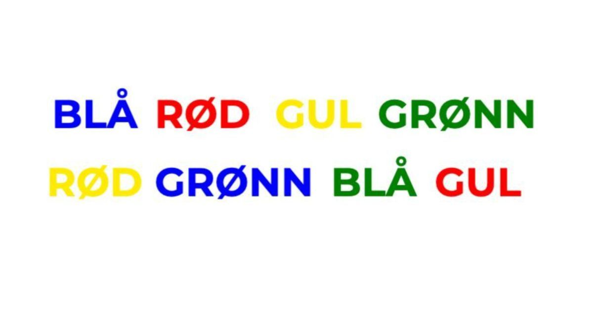
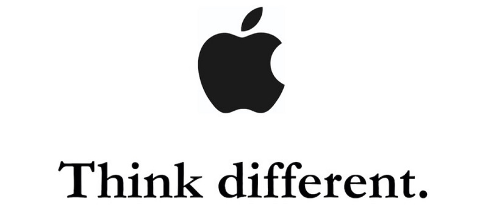
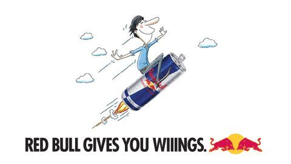

La oss starte med et eksempel på hva primingeffekten er i stedet for en lengre definisjon. Les teksten som står på bildet nedenfor 👇

Er det ikke vanskeligere å lese ordene på den andre linjen?

Grunnen er at teksten ikke stemmer overens med informasjonen som formidles. Når du leser ordet "grønn", men fargen er blå så stemmer ikke dette med det hjernen forventer. 

Objektivt gir ikke dette mening. Ordene på bildet formidler den samme informasjonen uavhengig av fargene som benyttes. Men ordet blå får deg til å tenke på blå, og det inkluderer også andre ting som er blå.

Siden du nå har lest blå flere ganger så er underbevisstheten din i gang med å lage assosiasjoner. Blå himmel, blå strand, kanskje et blått basseng?

Og siden du nå leste disse ordene er du sannsynligvis mer mottakelig for ideen om ferie. Selv om du ikke er klar over det selv.

### Så hvorfor er dette et viktig konsept for markedsføring? 

Tenk at du skal lage en rabatt på flere av dine produkter. Du må først finne ut hvor mye avslag du kan gi og hvor mye penger du kan bruke på markedsføring. 

Det neste steget blir så å fortelle målgruppen om avslaget. Du presenterer derfor tilbudet med så stor skrift som mulig slik at det skal trekke oppmerksomheten til dine kunder. Alt dette virker logisk. 

Men her er problemet: hjernen til dine kunder lager en assosiasjon som er helt motsatt fra det vi logisk sett mener gir mest mening. 

Når vi blir presentert med flere tall samtidig vil vår underbevistheten bruke *størrelsen* på tallene til å bestemme hvem av dem som er best[^1]. 

La meg hvis deg hvordan dette fungerer: 

Hvilken ser du på først?

Se så hva som skjer når vi bruker tall: 

Dette er hvordan majoriteten av bedrifter presenterer sine tilbud. *Føles* ikke den nye prisen her større? 

Så det motsatte: 

Samme tall. Samme rekkefølge. Samme font. Men når de presenteres på denne måten så føles det forskjellig. 

Den nye prisen *føles* mindre. 

Forskning viser at når konsepter assosiert med "liten" eller "lav" kobles til pris, vil det påvirke vår oppfatning av prisen og sannsynligheten for at vi kjøper[^1]. 

## Vi ser med hjernen, ikke øynene

Dette er primingeffekten. Vår underbevissthet reagerer på informasjon som igjen påvirker fremtidige valg. 

Hjernen har utviklet seg til å både kunne fokusere på noe samtidig som den scanner omgivelsene for trusler/viktig informasjon. Du har for eksempel ubevist scannet omgivelsene minst tre ganger når du leste denne setningen [^2]. 

Hvis det ikke er noe farlig/viktig på gang så blir informasjonen aldri eskalert til den beviste delen av hjernen. Men selv om den aldri blir eskalert så kan du vedde på at informasjonen likevel påvirker folks oppførsel. 

Dette er grunnen til at priming fungerer. 

Det er også grunnen til at folk som sier at de ikke blir påvirket av reklamer tar *helt* *feil*. 

## Et bilde sier mer enn tusen ord, men en merkevare har mer enn tusen assosiasjoner 

Tror du en logo kan påvirke din oppførsel? Hva med en logo som blinker inn og ut så raskt at du ikke legger merke til den? 

I en studie ble deltakerne vist en video som blinket inn og ut med en kjent merkevare på 30 millisekunder. Ingen av deltakerne la merke til eller var klar over at dette skjedde. 

Studien viste at deltakerne som ble vist Apple sin logo ble mer kreativ i sine oppgaver enn de som ble vist IBM. De som ble vist Disney sin logo ble mer ærlig [^3].

En annen studie satte deltakerne til å spille et bilspill der bilene de fikk tildelt enten var dekorert med merkevaren til Red Bull, Coca-Cola, Guinness eller Tropicana. Ellers var bilene helt identisk. Samme modell, farger og ytelse. 

Så hvilken effekt tror du dette hadde på deltakerne? 

De som kjørte bilen med Red Bull sin merkevare kjørte mer aggressivt, raskere og tok flere risikoer. Red Bull "ga de vinger" [^4].

## Primingeffekten og markedsføring

Alle disse eksemplene kan oppsummeres på en måte: **alt har en betydning.**

Dette gjelder ikke bare de ordene, lydene og bildene vi bruker, men også det målgruppen gjør rett før de treffer våre annonser. 

Et fellestrekk i alle studiene sitert i denne artikkelen er at ingen av deltakerne trodde de ble påvirket. 

Dette er grunnen til at primingeffekten (og andre effekter innen adferdsøkonomi) er så kritisk viktig å forstå for vår markedsføring. Folk vil aldri klare å si hva de faktisk vil gjøre eller hva som påvirker deres valg. 

> Folk vil aldri klare å si hva de vil gjøre eller hva som påvirker deres valg. 

Tenk derfor på de mest bokstavelige assosiasjonene hjernen lager når den ser din markedsføring. Representerer alle elementene budskapet du ønsker å kommunisere? Kok det ned til de minste detaljene og se om de formidler det samme budskapet. 

---

Se gjerne filmen under for enda et eksempel på primingeffekten. Den varer nesten 7 minutter, men hvis du likte eksemplene over så kommer du til å elske denne 👇

`youtube: EUA4Q5aoG74`

## Kilder

[^1]: [Size Does Matter: The Effects of Magnitude Representation Congruency on Price Perceptions and COULTER AND COULTER SIZE DOES MATTER Purchase Likelihood](https://production.wordpress.uconn.edu/businessmarketing/wp-content/uploads/sites/724/2014/08/size-does-matter.pdf)
[^2]: [What do eye movements tell us about patients with neurological disorders?](https://www.ncbi.nlm.nih.gov/pmc/articles/PMC5790757/)
[^3]: [Automatic Effects of Brand Exposure on Motivated Behavior: How Apple Makes You “Think Different”](https://faculty.fuqua.duke.edu/~gavan/bio/GJF_articles/apple_ibm_jcr_08.pdf)
[^4]: [Red Bull “Gives You Wings” for better or worse: A double-edged impact of brand exposure on consumer performance](https://www.sciencedirect.com/science/article/abs/pii/S1057740810001257)
