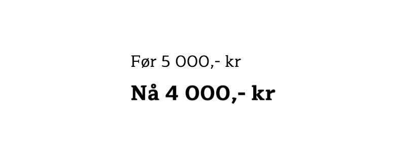
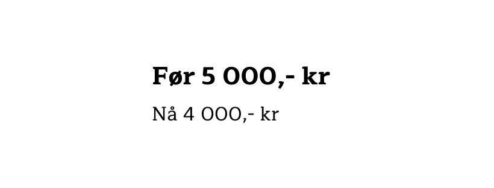

Primingeffekten

* Eksempel på priming

Visual primes

* Hjerner vår scanner sine omgivelser kontinuerlig.
  * Mens du leste denne setningen scannet øynene dine omgivelsene minst X sekunder
    * https://www.ncbi.nlm.nih.gov/pmc/articles/PMC5790757/
* Vi er ikke klar over det, men øynene våres beveger seg kontinuerlig. 
  * Rundt tre ganger i sekunder gjennomsnitt
  * Og sjekker omgivelsene for trusler og farer

* Hvis det ikke er noe farlig på gang så sendes det ikke noe alarm til den beviste delen av hjernen
  * Siden den ikke trenger å vite om det
  * MEN, det betyr ikke at informasjonen ikke påvirker vår oppførsel 

* Dette er grunnen til at priming fungerer.
  * Og er også grunnen til at folk som sier at de ikke bryr seg om annonser eller ikke legger til reklamer tar feil.

* Se for deg at du leser en artikkel mens du venter på at din kaffe blir ferdig. 
  * Du er ikke klar over det, men artikkelen du leste hadde flere annonser for made up bedrifter.
* Hvis jeg spør deg om det etterpå så er du mer sannsynlig til å kjenne igjen eller velge disse merkene, selv om du ikke husker å ha sett de tidligere. 
  * https://hbr.org/2007/03/getting-attention-for-unrecognized-brands

* Den underbeviste delen av hjernen evaluerer kontinuerlig denne typen informasjon, selv om det aldri blir eskalert til din bevisthet.
  * Men når hjernen vil ha en distraksjon, eller noe spennende skjer? Da legger du merke til det 

* Har du noen ganger lært deg ett nytt ord, bare for å så legge merke til dette ordet overalt de neste dagene? 
  * Hva er grunnen til dette? Vi blir jo bombadert med ord hele tiden
* Grunnen er at hjernen vår evaluerer hundre tusenvis av ord, men ignorerer de fleste.
  * Ikke noe annet ord var viktig nok til å få oppmerksomhet fra den beviste delen av hjernen
* Dette er også grunnen til at hvis du nettopp har kjøpt deg en Telsa, så starter du å legge merke til alle andre Tesla overalt.
  * De var der bestandig fra tidligere, men de var aldri viktig nok til å bli eskalert. 
  * Men nå har hjernen lært seg at tesla er viktig, så det må esklaeres!

Syn skjer i øynene, men hva ser skjer i hjernen // Vi ser med hjernen, ikke øynene 

https://theconversation.com/how-do-our-brains-reconstruct-the-visual-world-49276

* Vår synsans skjer med øynene, men hva vi ser skjer med i hjernen.

* Vi har utviklet oss til å både kunne fokusere på noe samtidig som vi kontinuerlig scanner omgivelsene for trusler/viktig informasjon. 
  * Hjernen vår fletter sammen det som egentlig er stillbilder, og kobler sammen manglende biter slik at vi opplever en jevn begevelsesflyt
* Den forutser hva som mangler, slik at vi opplever våre omgivelser som konstant. 

* Dette er også grunnen til at vi ikke liker endring. 
  * Hjernens jobb er å holde oss i livet gjennom å evaluere så mye som mulig gjennom sitt regelsett.
* Så selv om dine kunder ikke legger merke til en annonse eller et bilde, så kan du vedde på at det likevel påvirker deres oppførsel

* Eksempel med logo
  * https://faculty.fuqua.duke.edu/~gavan/bio/GJF_articles/apple_ibm_jcr_08.pdf
* Mer kreativ når de fikk sett Apple sin logo i stedet for IBM
  * De som så Disney sin logo var også mer ærlig 

Et bilde er bedre enn tusen ord, men en sterk merkevare har tusen minner 

Lyder

* Forskjellige følelser kan trigges av lyder for å påvirke folks oppførsel
  * http://belzludovic.free.fr/nolwenn/Kotler%20-%20Atmospherics%20as%20a%20marketing%20tool%20%20%28cit%C3%A9%20171%29%20-%201973.pdf
* La oss si at du eier en resturant
  * Skal du spille raskt eller rolig musikk?
* Avhenig av hva din strategi er 
  * Hvis ditt mål er at dine kunder skal bli ferdig så raskt som mulig så burde du spille rask musikk. 
* Hvis du derimot vil at de skal ta sin tid og bestille så mye som mulig så burde du spile rolig musikk
  * https://www.researchgate.net/publication/233231739_The_Effects_of_Background_Music_on_Consumer_Responses_in_a_High-end_Supermarket
* Det er derfor så viktig å forstå hvordan du tjener penger, slik at du kan trykke på de riktige knappene

* Ikke undervurder dette punktet. 
  * Studier viser at når det spiller bakgrunnsmusikk som passer inn med merkevaren
    * Så vil tiden i butikken øke med så mye som 22 minutter

* Dette fungerer også online
  * Ebay gjennomføre en undersøkelse der de fant at de som hørte på popmusikk og saklige samtaler (fotball kommentarer, økonomiske rapporter) gjorde på gjennomsnitt bedre kjøp.
  * De som hørte på klassisk musikk overvurderte verdien av produktene de kjøpte med ca 5%. 
    * https://www.ebayinc.com/stories/press-room/uk/radio-chatter-and-football-the-sounds-that-help-us-shop/

Kan du hold denne?

* Holde kals vs varm kaffe
  * Når de senere deltok i studien fikk de som oppgaver å lese en historie om en person.
  * De som før ble spurt om å hold en varm kaffe rangerte denne personen som betydelig varmere enn de som holdte iskaffe. 
  * https://www.ncbi.nlm.nih.gov/pmc/articles/PMC2737341/
* Så en helt urealisert hendelse påvirket deres senere oppførsel. 
  * Poenget her er hvor direkte hjernen assosierer forskjellige konsepter.
    * Kald drikke = kalde hender = kald personlighet. 

Eksempel om font

Tenk at du skal lage en rabatt på flere av dine produkter. Du må først finne ut hvor mye avslag du kan gi og hvor mye penger du kan bruke på markedsføring. 

Det neste steget blir så å fortelle målgruppen om avslaget. Du presenterer derfor tilbudet med så stor skrift som mulig slik at det skal trekke oppmerksomheten til dine kunder. Alt dette virker logisk. 

Men her er problemet: hjernen til dine kunder lager en assosiasjon som er helt motsatt fra det vi logisk sett mener gir mest mening. 

Når vi blir presentert med flere tall samtidig vil vår underbevistheten bruke *størrelsen* på tallene til å bestemme hvem av dem som er best(kilde). 

La meg hvis deg hvordan dette fungerer: 

Hvilken ser du på først?

Se så hva som skjer når vi bruker tall: 

Dette er hvordan majoriteten av bedrifter presenterer sine tilbud. *Føles* ikke den nye prisen her større? 

Så det motsatte: 

Samme tall. Samme rekkefølge. Samme font. Men når de presenteres på denne måten så føles det forskjellig. 

Den nye prisen *føles* mindre. 

Forskning viser at når konsepter assosiert med "liten" eller "lav" kobles til pris, vil det påvirke vår oppfatning av prisen og sannsynligheten for at vi kjøper (kilde). Denne effekten kan påvirke salg med så mye som 28% (kilde).

---

Tenkt derfor på de de mest bokstavlige assosiasjonene hjernen kan lage neste gang du annonserer et tilbud. Representerer alle elementene budskapet du ønsker å kommunisere? 

Når du vurderer hvordan du skal bruke skrifttype og størrelse, ta et skritt tilbake og tenk på den mest bokstavelige assosiasjonen hjernen kan lage. Hvis du koker det ned til de minste elementene, er de som kommuniserer det større budskapet?

https://production.wordpress.uconn.edu/businessmarketing/wp-content/uploads/sites/724/2014/08/size-does-matter.pdf

* Dette gjelder også for bilder, lyder og lukter. 
  * Selv noe så enkelt som skriftstørrelse har blitt bevist til å påvirke (liten skriftstørrelse = liten pris
    * https://www.inc.com/melina-palmer/the-font-size-on-your-price-tags-could-be-reducing-your-sales-by-28-percent-heres-how-to-fix-it.html)

* Skrifttype kan endre hvordan du føler om det du leser. Bilde av en person som drikker en kald drikke i din markedsføring kan få folk til å ignorere deg
  * Det er derfor priming er viktig.
    * Er det ikke mye bedre å tenke på innvirkningen av bildene, teksten og lydene du bruker før du bruker dem? 

Priming og markedsføring

* Dette kan oppsummeres på en måte: Alt har en betydning
  * Dette gjelder ord og bilder på vår markedsføring, og hva vår målgruppe gjorde rett før de traff vårt materiell.
* Vi kan derfor ikke kontrollere alt sammen, men det er likevel viktig å se på de elementene vi kan kontrollere 

* En av de viktigste poengene med priming er at på tvers av alle studiene jeg har sitert her, så sa alle deltakerne at de ikke ble påvirket. 
  * Eller at de ikke la merke til noe som helst forskjellig
* Det er derfor det er så kritisk å forstå dette konseptet i vår markedsføring.
  * Folk kan ikke fortelle deg hva de kommer til å gjøre og hva som påvirker deres valg. 

Prøv det selv

