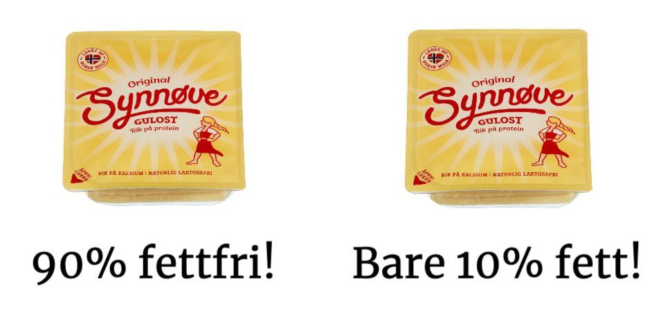
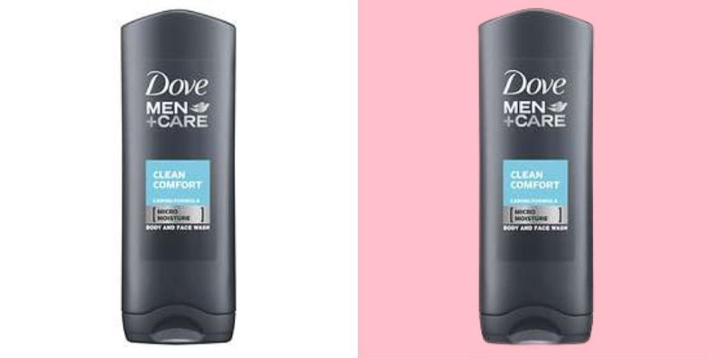
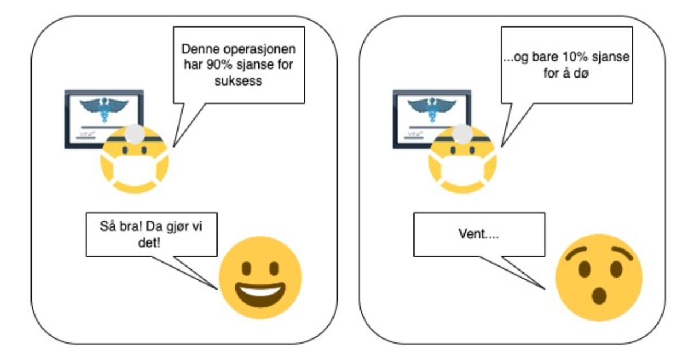

Se for deg at du er i gang med å lage matpakke for barna. Du legger frem brødskivene, hiver på godt med smør, og innser alt for sent at du har godt tom for ost! Du hiver deg derfor i bilen og kjører til nærmeste Rema 1000. 

Du parkerer bilen og småjogger bort til den plassen du vet de har osten. Der blir du presentert med disse to innpakningene fra Synnøve: 

Hvilken en velger du? 

Folk flest vil velge den til venstre, men hvorfor? 90% fettfri og 10% fett er jo akkurat den samme tingen. Selv om pakken med 10% fett har vært noen kroner billigere så har du nok uansett valgt den første.

Måten vi blir presentert for informasjon har stor påvirkning på hvordan informasjonen oppfattes. Grunnen er at vår underbevissthet evaluerer og tar beslutninger basert på antagelser. 

Når vi ser et maleri med en flott innramming vil vi umiddelbart anta at maleriet i selg selv må være av høyere kvalitet. Når vi ser et høyt tall tror vi at produktet må ha høyere verdi[^1]. Dette er rammeeffekten.

## “It’s toasted”

Hvis du har sett Mad Men så husker du kanskje denne scenen. Denne tar plass på 1960 tallet der den amerikanske regjeringen nettopp har gjort det ulovlig å annonsere tobakk med helsepåstander. 

Lucky Strike har derfor et stort problem: Hvordan kan de annonsere hvis de ikke kan si at deres sigaretter er trygge?

Don Draper innser at dette ikke er et problem, men i stedet en fantastisk markedsmulighet. Ingen av tobakkselskapene i markedet kan komme med helsepåstander. Så det de trenger er en annen vinkling: De trenger en annen *ramme*.

Han foreslår derfor at de annonserer Lucky Strike som «toasted».

Når lederen påpeker at andre merkers sigaretter også er toasted, sier han: «No, everybody else’s tobacco is poisonous. Lucky Strike is toasted.»

`youtube: E0L8f1IY1Vk`

## Samme produkt, forskjellig oppfatning

Rammeeffekten sier at folk tar forskjellige beslutninger basert på forskjellige innramminger, uansett om resultatet av beslutningen er det samme.

Don Draper fokuserte folks oppmerksomhet på et irrelevant aspekt ved sigarettene. Slik at de ikke lenger tenker på om de er farlig eller ikke. 

90% fettfri i stedet for 10% fett fokuserer folks oppmerksomhet på et høyere tall slik at den opplevde verdien økes[^2]. Samme produkt, men forskjellig oppfatning. 

Hverdagen vår er full av slike rammer, og hjernen vår er helt avhengig av de for å ta beslutninger. Hva du sier er derfor ikke like viktig som hvordan du sier det.

> Hva du sier er *ikke* like viktig som hvordan du sier det.

## Hvorfor har de fleste bilreklamer svarte, grå eller hvite biler?

Tenk på det neste gang du ser på tv. Majoriteten av alle bilreklamene viser biler som er en variasjon av svart, grå eller hvit. 

Farger kan på samme måte som tall og ord brukes til å skape nye kvaliteter og unike perspektiver. Disse påvirker igjen folks beslutningsprosess. 

Så hvorfor disse fargene? Fordi de er nøytral. 

Hvilken farge som benyttes på et produkt har en betydelig effekt på hvordan folk tolker og oppfatter produktet[^3]. En gul Audi har nøyaktig den samme kvaliteten som en svart, men en slik ramme vil ikke appellere til store deler av markedet. Nøytrale farger gjør det motsatte. 

*Tror du bildet med rosa bakgrunn vil ha solgt like mange som den med hvit?* 

## 90 prosent sjanse for å overleve eller 10 prosent sjanse for å dø?

Se for deg at du sitter på legekontoret. Du venter nervøst mens legen forteller deg om en operasjonen du burde ha. 

Etter en lang forklaring på hvorfor du må ha denne operasjonen konkluderer legen med at det ikke er veldig stor risiko. Hele 90% av alle pasienter lever fem år etter denne prosedyren! (positiv ramme)

I et alternativ univers sitter du også på legekontoret og venter nervøst mens legen forteller deg om operasjonen du burde ha. 

Etter en lang forklaring på hvorfor du må ha denne operasjonen konkluderer legen med at det ikke er veldig stor risiko. Bare 10% av alle pasienter dør innen fem år etter denne prosedyren! (negativ ramme)

Hvilke av disse versjonene tror du har overbevist deg til å gjennomføre prosedyren? 

Rammer kan ha både positive og negative effekter. Positive rammer påvirker vår beslutningsprosess ved å kaste et positivt lys over negative aspekter, Negative rammer påvirker med å skape hastverk: "*Vi har bare ett av dette hotellrommet tilgjengelig, og det er X antall andre som også ser på dette rommet nå*."

Generelt sett er positive rammer best til å overbevise, mens negative er best til å konvertere salg. 

Positive og negative rammer kan også slås sammen. For eksempel: "Bensinprisene kommer bare til å øke og øke fremover (negativ ramme), men hvis du kjøper denne elektriske bilen så vil du spare masse penger (positiv ramme)".

Presenter først problemet, derreter løsningen. Klassisk markedsføring.

## Rammeeffekten og markedsføring

Når vi bruker rammeeffekten i markedsføring hjelper vi hjernen til vår målgruppe med å evaluere og sammenligne. 

Målet er at underbevisstheten til vår målgruppe skal kunne ta beslutninger uten at beviste delen av hjernen blandes inn. 

95% av alle kjøpsbeslutninger tas ubevist[^4], og det er en massiv fordel hvis vi kan ramme inn vårt budskap slik at det havner innunder denne gruppen. 

### Hvordan bruke rammeeffekten

Start med å se etter tall i din bedrift som enten sier noe om bedriften i sin helet eller om produktet/tjenesten du selger. 

Finn deretter så mange måter som mulig å snakke om dette tallet på. Snu det på hodet, prøv med prosenter, desimaler, og andre uttrykk helt til du finner en variasjon som føles bedre enn de andre. 

Hvis du for eksempel har en churn på 25% kunne du ha rammet inn dette som: "75% av våre kunder kjøper av oss igjen!", men det høres ikke helt bra ut. 75% er ikke et høyt nok tall til å kunne bety "alle" i hodet til folk. 

"Tre av fire kunder kjøper av oss igjen" høres derimot mye bedre ut. 

Andre måter vi kan ramme inn dette på er:

> * De fleste kjøper av oss igjen
> * 8 av 10 kunder elsker våre tjenester
> * En av fire kommer aldri tilbake

Alle disse sier den sammen tingen, men de *føles* forskjellig. 

Dette er makten til rammeeffekten.

## Kilder

[^1]: [Perspective in Statements of Quantity, with Implications for Consumer Psychology](https://journals.sagepub.com/doi/abs/10.1111/1467-9280.00424?casa_token=OFcP8Kbj1aoAAAAA%3A_y1nExXTFzB4v3_mvRsIqiqEI7Ri1oEDTtiXDR0oAmN-MUuwWlTa27_54YFsASeI0FDWur5ts0dD&)
[^2]:[Five Different Types of Framing Effects in Medical Situation: A Preliminary Exploration](https://www.ncbi.nlm.nih.gov/pmc/articles/PMC3652505/#A8469R10)
[^3]: [Color Psychology: Effects of Perceiving Color on Psychological Functioning in Humans](https://www.deweycolorsystem.com/wp-content/uploads/2020/06/Credentials-Color-Psychology.pdf) 
[^4]: [The Subconscious Mind of the Consumer (And How To Reach It)](https://hbswk.hbs.edu/item/the-subconscious-mind-of-the-consumer-and-how-to-reach-it)
