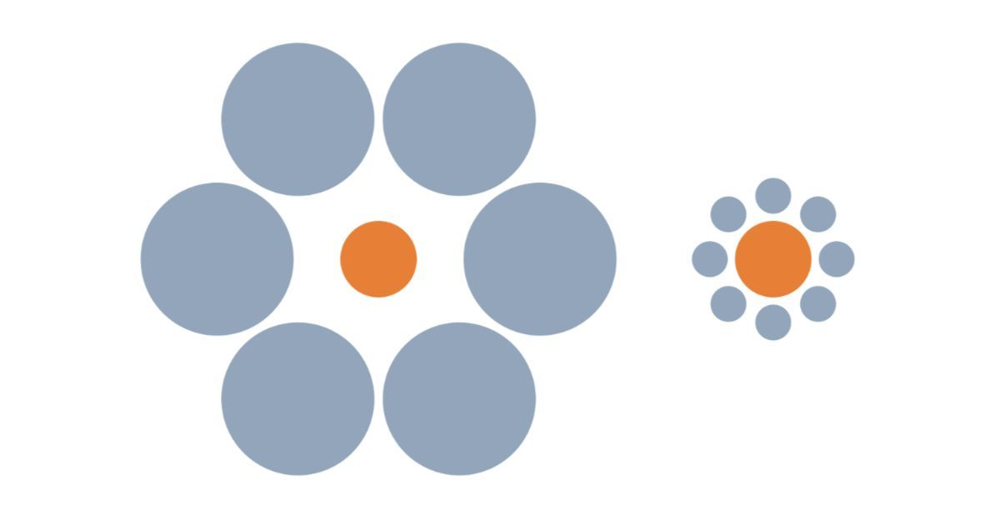

Se for deg at du står i køen på Rema 1000 for å kjøpe kjøttdeig til tacofredag til 100 kroner. Du synes det er dyrt, men du må jo ha nok kjøtt.

Plutselig husker du at Obs har tilbud på kjøttdeig denne uten, bare 50 kroner per pakke. 

Hva gjør du? Kjøper du den på Rema siden du allerede er der, eller kjører du til Obs for å spare 50 kroner? 

Jeg tipper at du kjører til Obs. 

Men la oss prøve med et annet eksempel. 

Se for deg at du er på Obs for å kjøpe et lammelår til 700 kroner. Mens du står i køen hører du noen si at dette var dyrt. Rema har jo akkurat samme lammelår til 650 kroner!

Hva gjør du da? 

Jeg tipper at du kjøper den på Obs siden du allerede er der. 

Hvorfor er det slik? Du sparer jo 50 kroner i begge tilfellene. Hva du kjøper burde jo komme akkurat på det samme. 50 kroner er 50 kroner. 

Men hjernen er dessverre ikke så enkelt. 

50 kroner sammenlignet med 100 føles mye mer enn 50 kroner sammenlignet med 700. 

Den relative prisen på et produkt påvirker veldig direkte din oppførsel. 

Dette kaller vi relativitetsbias.

## There is nothing high or low but comparing makes it so

Menneskehjernen evaluerer ikke valg i et vakuum. Produkter er kun dyr eller billig, varmt eller kaldt, stort eller lite i sammenligning med andre produkter[^fn1]. Denne effekten er så kraftig at den til og med bestemmer hvordan vi oppfatter verden rundt oss. 

La meg illustrere dette med et berømt eksempel fra 1890 tallet[^fn2]: 

Det er to oransje sirklene i midten er akkurat samme størrelse, men det ser ikke slik ut.

Den opplevde størrelsen til sirkelen i midten er avhengig av hva du sammenligner den med. I forhold til de store sirklene så virker den liten, og i forhold til de små sirklene virker den stor.

Dette er også hvordan hjernen tolker verden rundt oss. Den tolker ting relativt, og sammenligner alt sammen, hele tiden. Uansett om vi er klar over det eller ikke. 

## Relativitetsbias og markedsføring

Relativitet spiller en viktig rolle i markedsføring. Din målgruppe vil bestandig sammenligne dine produkter og tjenester opp mot *noe*, og det er en stor fordel hvis du kan påvirke hva det sammenlignes opp imot. 

Dette kan gjøres så enkelt som å vise et dyrere produkt på siden av produktet du ønsker å selge, slik at hjernen får et referansepunkt for å sammenligne. 

Eller ved å vise den originale prisen på produktet sammen med salgsprisen. Dette lar hjernen sammenligne og identifisere den rabatterte prisen som et godt tilbud. 

Du kan også introdusere et helt nytt grunnlag for sammenligning. Tenk på hvordan Nescafe markedsfører deres kaffekapsler, som gir akkurat nok kaffe til en kopp. 

Dette gjør at hjernen sammenligner med hva det koster å kjøpe en kopp kaffe andre plasser, ikke med hva det koster å lage kaffe med andre kaffemaskiner. Plutselig er 50 kroner for 16 kapsler blitt billig, ikke dyrt. 

Tenk derfor på om du gir hjernen til din målgruppe et referansepunkt å sammenligne opp i mot. Ved å gi underbevisstheten den informasjonen den trenger, vil den beviste delen av hjernen automatisk forklare hvorfor det du selger er et fantastisk tilbud. 

## Kilder

[^fn1]: Predictably Irrational: The Hidden Forces that Shape Our Decisions
[^fn2]: Ebbinghaus illusion

